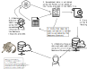

<!-- badges: start -->
[](https://lifecycle.r-lib.org/articles/stages.html#stable)
[](https://www.nsf.gov/awardsearch/showAward?AWD_ID=1948926)
[](https://www.nsf.gov/awardsearch/showAward?AWD_ID=2410961)
[](https://doi.org/10.5281/zenodo.10201957)
[](https://www.bestpractices.dev/projects/11101)
[](https://github.com/NeotomaDB/DataBUS/actions/workflows/ci.yml)
[](https://codecov.io/gh/NeotomaDB/DataBUS)
<!-- badges: end -->

# Working with the Neotoma's DataBUS (Data Bulk Uploading System)

This set of python scripts is intended to support the bulk upload of a set of records to Neotoma.

It consists of three key files:

1. A folder with CSV files
2. A YAML data template that maps data in the CSV files with the Neotoma Database.
3. A Python script that validates and uploads the data.

Once these three steps are completed the main script should first push the csv files into the `neotomaholdingtank` database. This is a temporary database that is intended to hold data within the Neotoma Paleoecology Database system for access by Tilia.

After the data is verified and the stewards feel confident in the upload, then, the script is run once more with the flag `--upload = True` to upload data to Neotoma proper.



## Template Development

An example YAML template ([`data/template_example.yml`](data/template_example.yml)) and a sample CSV ([`data/data_example.csv`](data/data_example.csv)) are provided to help you get started.

The template uses a `yaml` format file, with the following general structure for each data element:

```yaml
apiVersion: neotoma v2.0
kind: Development
metadata:
  - column:  Site.name
    neotoma: ndb.sites.sitename  
    vocab: False
    rowwise: True
    type: string
    ordered: False
```

The template is used to link the template CSV file (the file that will be generated by the stewards upload team) to the Neotoma database. It is a form of cross-walk between the upload team and the existing database structure.

All YAML files should begin with an `apiVersion` header that indicates we are using `neotoma v2.0`. This is the current API version for Neotoma (accessible through [api.neotomadb.org](https://api.neotomadb.org)). This field is intended to support future development of the Neotoma API.

The `kind` field indicates whether we are prepared to work with the production version of the database. Options are `development` and `production`. For testing purposes all YAML files should set `kind` to `development`.

## `metadata`

Each entry in the `metadata` tab can have the following entries:

* `column`:  The column of the spreadsheet that is being described.
* `neotoma`: A database table and column combination from the database schema.
* `vocab`: If there is a fixed vocabulary for the column, include the possible terms here.
* `rowwise`: [`true`, `false`] Is each entry unique and tied to the row (`false`, this isn't a set of repeated values), or is this a set of entries associated with the site (`true`, there is only a single value that repeats throughout)?
* `type`: [`integer`, `numeric`, `date`, `str`] The variable type for the field.

```yaml
metadata:
  - column: Coordinate.precision
    neotoma: ndb.collectionunits.location
    vocab: ['core-site','GPS','core-site approximate','lake center']
    rowwise: True
    type: str
```

In this case we see that the team has chosen to create a column in their spreadsheet called `Coordinate.precision`, it is linked to the Neotoma table/column `ndb.collectionunits.location`. We state that it requires one term from a fixed vocabulary, the value repeats within the column, it is expected to be a `str` (as opposed to an `integer` or `numeric` value) and each row has its own value.

A complete list of Neotoma tables and columns is included in [`tablecolumns.csv`](docs/tablecolumns.csv), and additional support for table concepts and content can be found either in the [Neotoma Paleoecology Database Manual](https://open.neotomadb.org/manual) or in the [online database schema](https://open.neotomadb.org/dbschema).

Using the YAML template we can create complex relationships between existing data models for particular sets of records coming from individual researcher labs or data consortiums and the Neotoma database.

On completion of the YAML file, each column of the CSV will have an entry that fully describes the content of the data within that column. At that point we can validate the CSV files intended for upload.

## Validation

We execute the validation process by running (see [`databus_example.py`](databus_example.py) for the full example script):

```bash
uv run databus_example.py --data FILEFOLDER/ --template template.yml --upload False
```

This will then search the folder provided in `FILEFOLDER` for csv files and parse them for validity.

The set of tests for validity depends on the data content within the YAML file, but must at least include:

* Site Validation
* Collection Unit Validation
* Analysis Unit Validation
* Dataset Validation
* Dataset PI Validation
* Sample Validation
* Data Validation

Templates with more elements will be tested depending on the data content provided.

Each file will recieve a `log` file associated with it that contains a report of potential issues:

```txt
53f0a3feb956a4fa590a9d45b657f76e
Validating data/FILENAME.csv
Report for data/FILENAME.csv
=== Checking Template Unit Definitions ===
✔ All units validate.
. . .
. . .
=== Checking the Dating Horizon is Valid ===
✔  The dating horizon is in the reported depths.
```

The log files begin with an [md5 hash](https://en.wikipedia.org/wiki/MD5) of the csv template file. This appears as a string of numbers and letters that record a point in time of the file. The hash is used to identify whether or not files have changed since validation.

The validation step identifies each element of the template being validated, provides a visual reference as to whether or not the element passes validation (**✔**, **?** or **✗**) and provides guidance as to whether changes need to be made.

## Upload

The script will be run a second time - if it is not run the first time, there will be no validation logs and the upload will not be allowed.

The upload process is initiated using the command:

```bash
uv run databus_example.py --data FILEFOLDER/ --template template.yml --logs FILEFOLDER/logs/ --upload True
```

The upload process will return the distinct siteids, and related data identifiers for the uploads.

## Contributors

This project is an open project, and contributions are welcome from any individual.  All contributors to this project are bound by a [code of conduct](CODE_OF_CONDUCT.md).  Please review and follow this code of conduct as part of your contribution.

* [](https://orcid.org/0000-0002-7926-4935) [Socorro Dominguez](https://ht-data.com/about)

* [](https://orcid.org/0000-0002-2700-4605) [Simon Goring](http://www.goring.org)

### Tips for Contributing

Issues and bug reports are always welcome.  Code clean-up, and feature additions can be done either through pull requests to [project forks](https://github.com/NeotomaDB/DataBUS/network/members) or [project branches](https://github.com/NeotomaDB/DataBUS/branches).

Before submitting a pull request, please ensure that:

* All existing tests pass: `uv run pytest tests/`
* Code passes Ruff linting and formatting: `uv run ruff check src/` and `uv run ruff format --check src/`
* New functionality includes corresponding tests in the `tests/` directory

These checks are enforced automatically by the [CI workflow](.github/workflows/ci.yml) on every push and pull request.

All products of the Neotoma Paleoecology Database are licensed under an [MIT License](LICENSE.md) unless otherwise noted.
